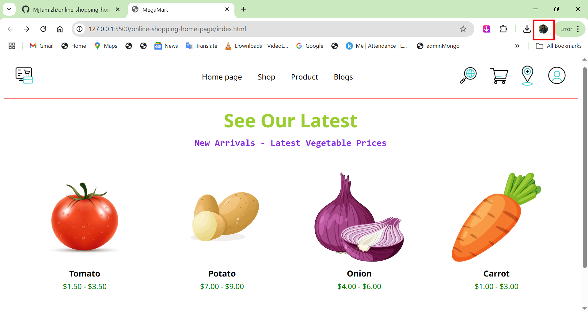

# 🛒 MegaMart – eCommerce Landing Page

Welcome to **MegaMart**, a responsive and clean eCommerce landing page built using **HTML5** and **CSS3**. This project is a static front-end UI showcasing a simple online grocery/vegetable store interface.

---

## ✨ Features

- 🖼️ Header with logo, navigation menu, and action icons (search, cart, location, profile)
- 🥬 Product section showcasing vegetables with images and prices
- ✅ Responsive and centered layout using Flexbox
- 🧾 Footer with copyright
- 🌐 Google Fonts integration (`Noto Sans`)

---

## Made with ❤️ by mjtamil

<!-- resourece  
icons
https://www.flaticon.com/animated-icons

ai image for blogs
https://pixabay.com/images/
-->
all created by mj tamil