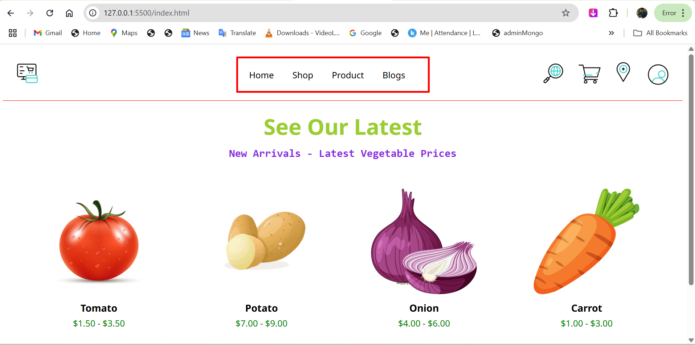

🛒 MegaMart – eCommerce Website (Front-End)
MegaMart is a responsive and clean multi-page eCommerce website built using HTML5 and CSS3. This front-end project simulates a real-world online grocery and vegetable store with structured navigation, dynamic sections, and consistent design components across pages.

🌟 Features
🧭 Header with logo, navigation menu, and action icons (search, cart, location, profile)

🏠 Home Page with introductory content and visual elements

🛍️ Shop Page showcasing featured deals and products

🥦 Product Page with gallery layout and product descriptions

📝 Blogs Page layout for article-style content

✅ Fully responsive layout using Flexbox

🌐 Google Fonts integration (Noto Sans)

📱 Clean, modern UI suitable for mobile and desktop views

🛠️ Technologies Used
HTML5

CSS3

Google Fonts – Noto Sans

📁 Resources
🎨 Icons from Flaticon - Animated Icons

🖼️ Images from Pixabay for blogs and visual content

📸 Screenshot

👤 Author
Made with  by mjtamil

